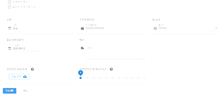
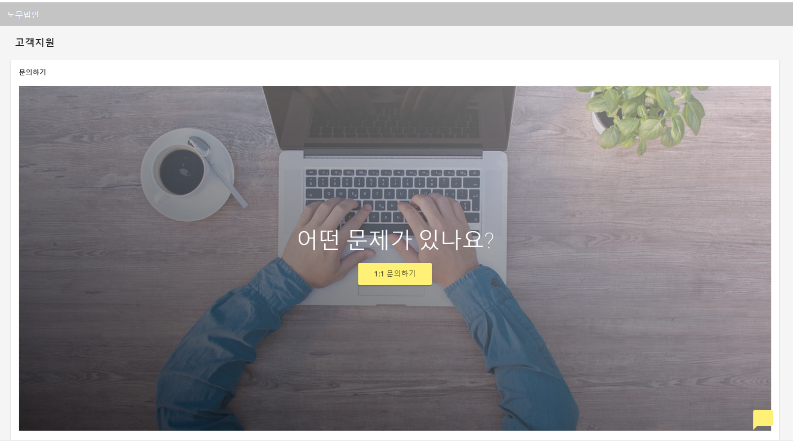
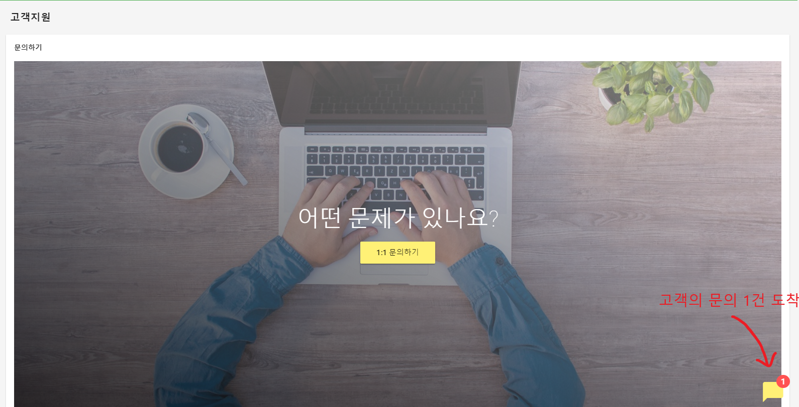

<p align="center">
  <a href="" rel="noopener">
 </a>
 <br>

 
</p>

<h3 align="center">Labor Corporation</h3>

<div align="center">


[]()
[](https://github.com/da-huin/labor_corporation/issues)
[](https://github.com/da-huin/labor_corporation/pulls)
[](/LICENSE)

</div>

---

<p align="center"> 노무법인의 일을 온라인으로 쉽게 처리 할 수 있도록 도와주는 웹페이지입니다.
    <br> 
</p>

## 📝 Table of Contents

- [About](#about)
- [Getting Started](#getting_started)
- [Usage](#usage)
- [Acknowledgments](#acknowledgement)

## 🏁 Getting Started <a name = "getting_started"></a>

### 🚀 Tutorial

#### 백엔드 서버 실행 방법

1. apache, php 가 필요합니다.
    * php mysqli 확장이 활성화되어있지 않다면 활성화해야합니다.

1. 백엔드 코드를 호스팅하는 폴더(`public_html`) 의 `server` 폴더에 넣어야합니다.

#### 프론트 서버 실행 및 빌드 방법

1. `cd front` 명령어로 콘솔에서 front 폴더로 들어갑니다.

1. 아래의 명령어로 의존성을 설치합니다.

    ```
    npm install
    ```

1. 개발 할 땐 hot-reloads 를 위해 아래의 명령어로 서버를 실행하세요. 

    * 이 명령어로 하면 세션이 저장되지 않는 문제가 발생합니다.
    * 개발 시 `server/ajax.php` 에 `$id` 를 직접 입력해주면 해결됩니다.
    * `CORS` 문제가 발생하면 `CORS` 를 허용해주는 크롬 확장플러그인을 사용하면 해결됩니다.

    ```
    npm run serve
    ```

1. 배포해야 할 땐 아래의 명령어로 빌드하세요.

    * 빌드하기 전 `front/src/store.js` 서버의 주소를 바꾸는 등 설정을 하세요.
    * 빌드한 경우 결과물은 `front/dist` 폴더에 저장됩니다.
    * 결과물을 호스팅하는 폴더(`public_html`)에 저장하세요.
        
        경로는 아래처럼 이루어져야 합니다.

        ```
        css/
        img/
        js/
        server/
        favicon.ico
        index.html
        ```

    ```
    npm run build
    ```

1. 로그인페이지는 `YOUR_SERVER_URL/#/about/welcome` 입니다.

1. `admin` 이라는 아이디가 없다면 계정을 `회원가입`에서 만들어야 합니다.

    이 계정은 관리자 계정입니다.

## 🎈 Usage <a name="usage"></a>

### 🌱 **/about/welcome**

    환영 페이지입니다. 지금 시작하기 버튼을 누르면 로그인 화면으로 이동합니다.


### 🌱 **/about/login**

    로그인 화면은 다음과 같습니다.


    회원가입 버튼을 눌렀을 때의 화면입니다. 각자의 필드마다 아이디 길이, 비밀번호 중복 등 유효성 검사가 진행됩니다.


    고객지원 버튼을 누르면 회사의 지도, 전화번호, 이메일이 표시됩니다.


### 🌱 **/home/... 페이지의 네비게이션**
    
    홈 화면의 네비게이션은 다음과 같습니다. 관리자 메뉴는 관리자 계정에게만 보입니다.


    빨간 네모의 아이콘 버튼을 클릭한 후의 화면입니다. 아바타를 변경 할 수 있습니다.


    아바타를 선택 시 아바타가 바뀝니다.


    
    더 넓은 화면을 위해 네비게이션을 접을 수 있습니다.


    다시 클릭하면 다시 펼 수 있습니다.


    
### 🌱 **/home/receipt**

    왼쪽 네비게이션에서 [온라인 신청서] 버튼을 누르면 다음 화면이 보여집니다. [기타신고 버튼]을 클릭하고 [신청서 작성]을 눌러보겠습니다.
    


    폼을 채우고 작성완료 버튼을 클릭해보겠습니다.


    접수가 완료되었다는 화면이 표시됩니다.



    어떤 신청서를 작성 할 때는 서식이 필요 할 수도 있습니다.
    신청서 페이지를 아래로 내려보면 [서식] 란이 있는데 서식을 추가하고 다운로드 받아보겠습니다.


    
    어떤 서식을 추가 할 지 정하는 곳입니다. 
    주의할점은 파일 여러개를 한번에 추가 할 경우 파일명을 띄어쓰기로 구분해야 한다는 것입니다.
    필드를 모두 입력하고 [추가] 버튼을 클릭해보겠습니다.


    서식이 새로 추가된 것을 확인 할 수 있습니다. [4대보험_사업장_변경신고서] 버튼을 클릭하면 서식으로 올렸던 파일이 다운로드됩니다.


### 🌱 **/home/help**

    고객지원 페이지입니다. 1:1 문의하기 버튼을 클릭해보겠습니다.



    아래와 같이 문의를 보낼 수 있습니다.
    


    관리자 계정에서 로그인하면 아래처럼 문의가 도착했다고 알림이 옵니다.
    


    고객관리 페이지에서도 확인 할 수 있습니다.


    문의에 답장을 할 수 있습니다. 이 채팅은 실시간으로 이루어집니다.


### 🌱 **/home/privacy**

    네비게이션에서 [홈 > 개인정보관리] 를 클릭하면 이 페이지가 표시됩니다.
    개인정보와 관리하는 회사를 수정 할 수 있습니다.


    
    
### 🌱 **/home/receipt_history**
    
    네비게이션에서 [홈 > 신청내역] 을 클릭하면 이 페이지가 표시됩니다.
    신청서 신청내역을 확인 할 수 있습니다. 신청내역 중 하나를 클릭해보겠습니다.


    신청서의 내용은 아래의 내용으로 표시됩니다.
    1. 신청서 이름
    2. 회사
    3. 내용
    4. 신청자
    5. 신청서 상세

    아래의 아이콘은 신청서가 어떤 상태인지 알려줍니다.


    재신청을 하거나 신청서를 취소 할 수 있습니다.


### 🌱 **/home/receipt_manage**

    [관리자 > 신청서 관리] 에서 확인 할 수 있습니다.
    관리자가 신청서를 확인 할 수 있는 페이지입니다. 
    신청서를 클릭해보겠습니다.


    신청서의 상세내역을 볼 수 있는데 아래의 아이콘 버튼을 클릭하여 신청서를 보류, 완료, 취소 상태로 바꿀 수 있습니다.


    신청서를 보류시켰을 때 왜 보류되었는지 알리기 위하여 보류 메시지를 설정 할 수 있습니다.


    노무법인 회사에 따라 다르게 표지와 신청서 정보를 엑셀 파일로 만들 수 있습니다.


### 🌱 **/home/user_manage**

    네비게이션에서 [관리자 > 회원 관리] 를 클릭하면 이 화면이 표시됩니다.
    회원정보를 관리 할 수 있습니다.


### 🌱 **/home/config**

    네비게이션에서 [관리자 > 설정] 을 클릭하면 이 화면이 표시됩니다.
    아래의 기능을 사용 할 수 있습니다.
    1. [공지사항 메세지]: 공지사항을 변경 할 수 있습니다.
    2. [신청서 업데이트 간격]: 신청서 관리 페이지를 n초 마다 자동으로 업데이트합니다.
    3. [파일 최대 크기]: 유저가 파일을 올릴 때 최대 크기를 지정할 수 있게 합니다.
    4. [보류, 완료된 신청서 자동삭제]: 로그아웃 후 로그인을 다시 할 경우 보류, 완료된 신청서를 자동삭제 하게 할 수 있습니다.
    5. [모든 신청서 삭제]: 모든 신청서를 삭제 할 수 있습니다.

    이번에는 공지사항을 변경해보겠습니다.


    위에 초록색 알림으로 공지사항이 표시됩니다.


## 🎉 Acknowledgements <a name = "acknowledgement"></a>

- Title icon made by [Freepik](https://www.flaticon.com/kr/authors/freepik).

- If you have a problem. please make [issue](https://github.com/da-huin/labor_corporation/issues).

- Please help develop this project 😀

- Thanks for reading 😄
